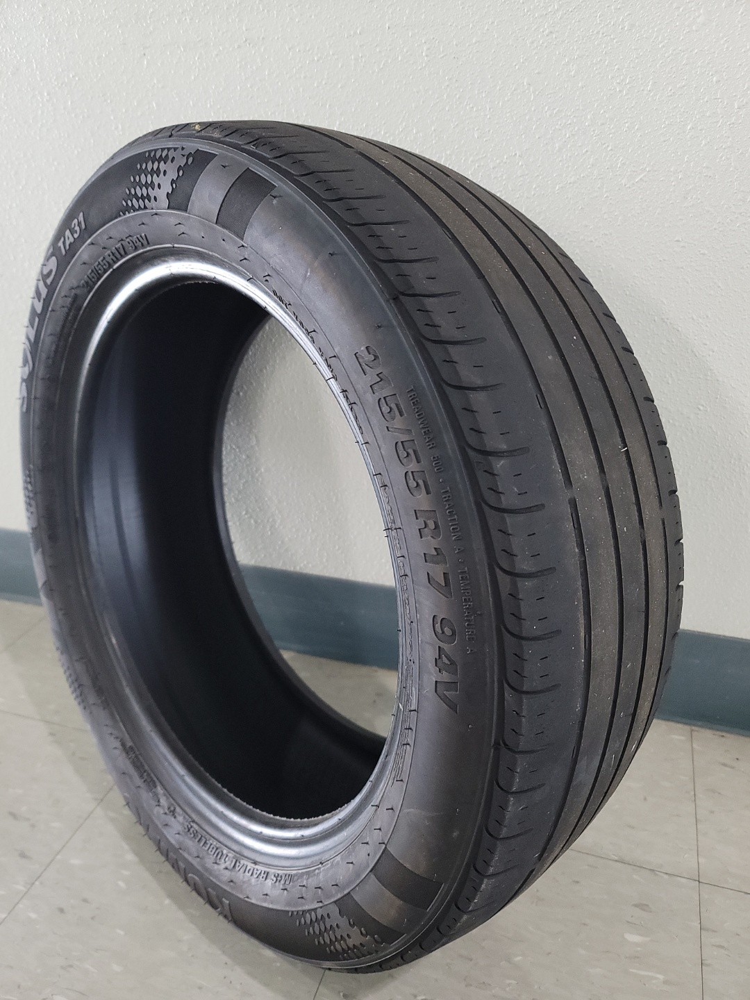
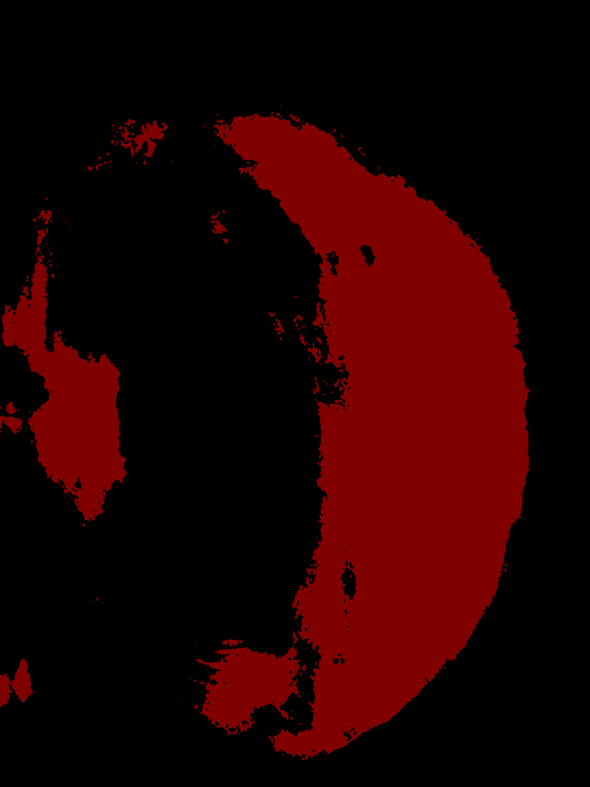
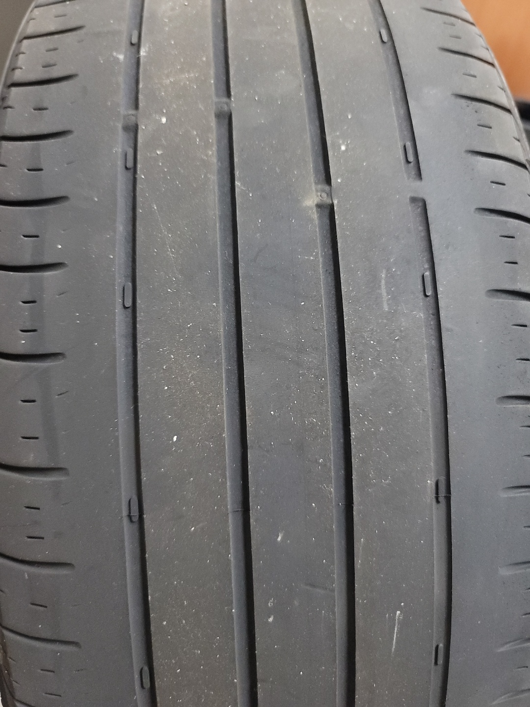
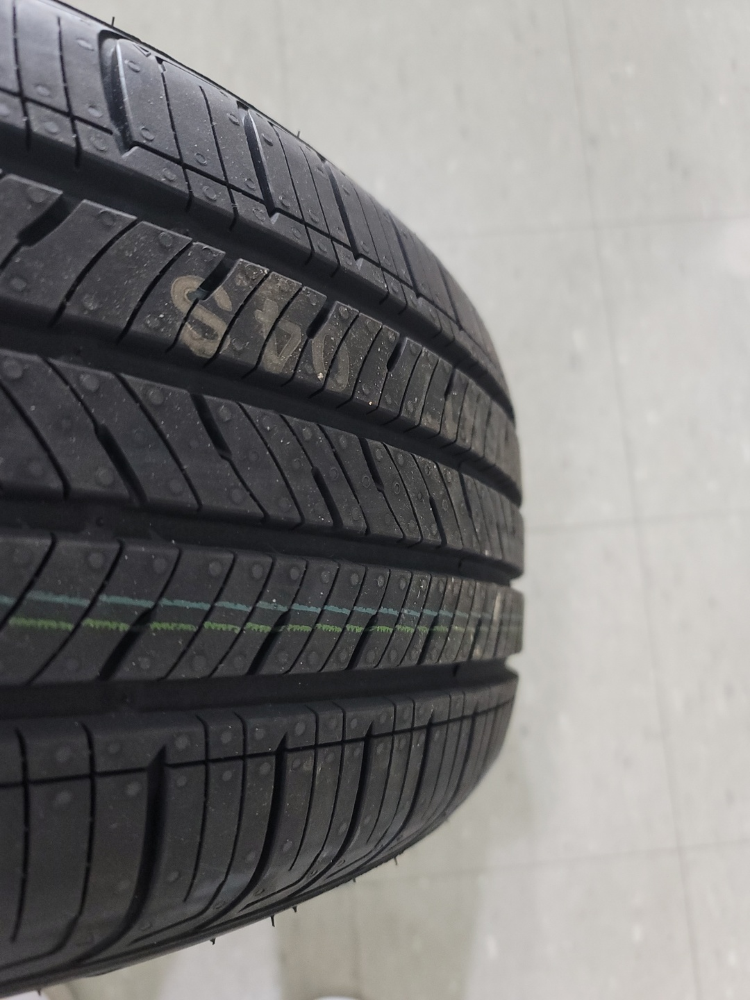
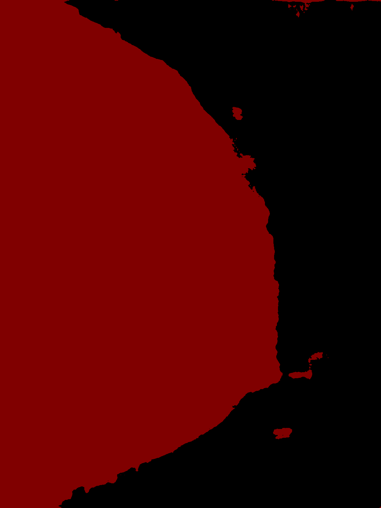
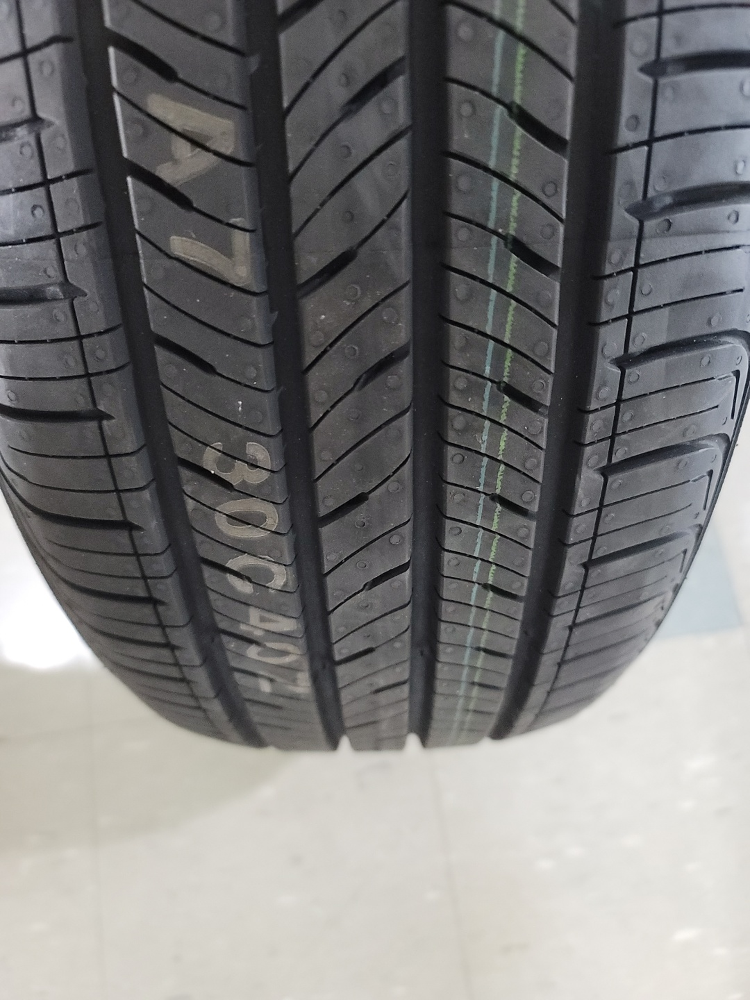
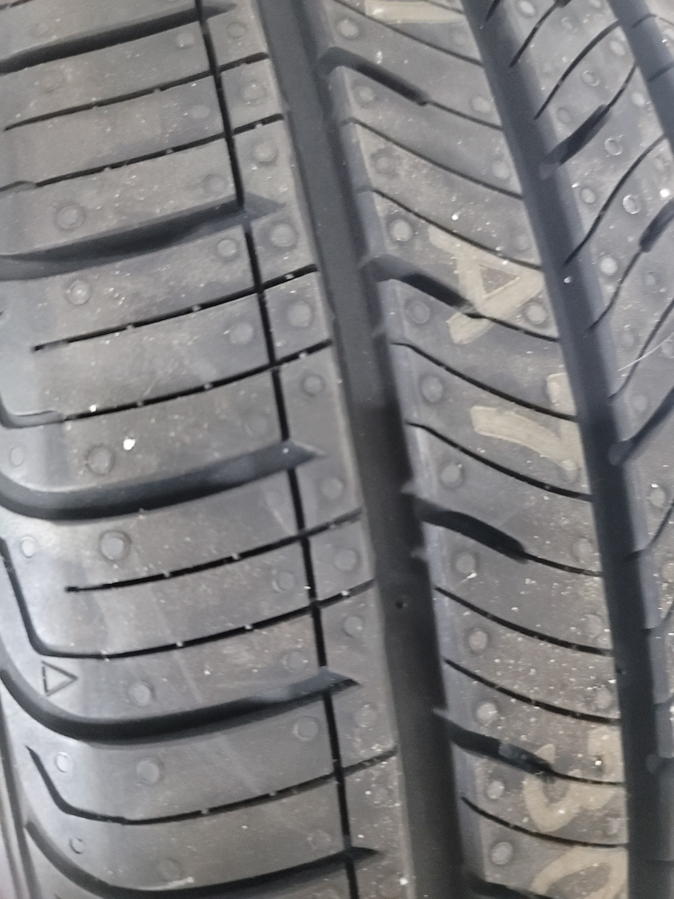

# 타이어 수명 예측 어플리케이션

# 목차
- [타이어 수명 예측 어플리케이션](#타이어-수명-예측-어플리케이션)
- [목차](#목차)
- [일정](#일정)
- [진행상황](#진행상황)
- [Weight File](#weight-file)
  - [양호준](#양호준)
  - [이문형](#이문형)
  - [정회준](#정회준)
  - [이석채](#이석채)
- [학습 (165.246.44.72에서 hojun_pytorchv2 도커 컨테이너로 진행)](#학습-1652464472에서-hojun_pytorchv2-도커-컨테이너로-진행)
- [실행파일](#실행파일)

# 일정
- 3월 1일까지  
  - [x] 인공지능 모델 모바일 어플리케이션 탑재
- 5월 27일까지
  - [ ] 타이어 세그멘테이션 및 Binearization (양호준, 이석채)
  - [ ] 타이어 깊이 추청 (이문형, 정회준)

# 진행상황

본인 이름 아래에 자기 계획 정리해두고 진행사항 **ipynb 파일로 정리**해서 남길 것 (전처리 작업, 혹은 계획사항 내지 진행사항 같은것 모두가 보기 쉽게 하여 협업하기 위함임)

# Weight File
easy_data: 연구실에서 직접 촬영한 타이어 데이터로 학습한 것
seg_data: 직접 타이어만 마스킹해서 배경은 검은색으로 설정하고 학습한 것

[Deeplabv3_easy_data](https://drive.google.com/file/d/1jG-ewC-F9zrbyHaiM0j8wPj_q79ARCaZ/view?usp=sharing)  
[android_deeplabv3_easy_data](https://drive.google.com/file/d/1LjWfv3wgRSH1lqIRCayDc1GV7sTtbSpS/view?usp=sharing)  
[android_efficientb7_easy_seg_data - (Regression. 외부 촬영 데이터만 학습 한 것)](https://drive.google.com/file/d/1HLehAmzaNetsWiXJyOkeor_2Gmn7Zc6Y/view?usp=sharing)  
[android_efficientb7_easy_seg_data_v2 - (Regression. 연구실 촬영 데이터까지 학습 한 것)](https://drive.google.com/file/d/19IH6qJZeQDzP9rxl0LpS3Jw0PUHU1SFP/view?usp=sharing)

- 2022-10 가중치 파일

[mobilenet_deeplabv3](https://drive.google.com/file/d/1fECgY0-SjTXQUzhN0jwG7ZdhqB7EBHOX/view?usp=sharing)

## 양호준
- [x] Kotlin 안드로이드 개발을 위한 문법 복습  
  [복습자료](https://yanghojun.github.io/Kotlin%20%EA%B8%B0%EC%B4%88/)
- [x] 안드로이드 인공지능 모델 튜토리얼 진행  
  [안드로이드 Deeplearning 기초 스크립트 작성](/pytorch2android.ipynb)
- [x] 타이어 어플리케이션 코드 리팩토링
  - [x] 카메라 - 갤러리 연동 파트 다시 공부 및 개발
  - [x] EditText의 로그인 기능 및 키보드 이벤트 공부  
  [버튼 이벤트 처리](https://yanghojun.github.io/%EB%82%B4%EA%B0%80%20%EB%B3%B4%EB%A0%A4%EA%B3%A0%20%EB%A7%8C%EB%93%A0%20%EC%95%88%EB%93%9C%EB%A1%9C%EC%9D%B4%EB%93%9C%20%EA%B8%B0%EC%B4%88%20%EC%B4%9D%EC%A0%95%EB%A6%AC/)
  - [x] 뷰 바인딩, 리사이클러 뷰, 레이아웃 개념, 뷰 페이저, 프래그먼트 공부
  - [x] 코틀린, 자바 문법 비교 및 한번에 복습 및 객체지향 사고 향상, 함수형 프로그래밍 사고 향상
    - [x] 인터페이스, 추상메소드, SAM, 확장함수, 람다식, 람다식 축약  
  [코틀린 기초](https://yanghojun.github.io/Kotlin%20%EA%B8%B0%EC%B4%88/)  
  [자바 기초](https://yanghojun.github.io/categories/Java)  
  - [x] 인공지능 Prediction UI 구현
    - [x] Fragment 접목
    - [x] ViewPager2 접목
    - [x] Custom Gallery 활용을 위해 오픈소스 코드 해석 및 적용
  - [x] GUI 다듬기
- [x] 타이어 세그멘테이션 & UI 다듬기
  - [x] 이미지 세그멘테이션 어플 돌리기(Pytorch 버젼 문제로 에러 발생해서 정신 나가는줄)
  - [x] 석채 세그멘테이션 데이터 받아서 학습하고 결과 확인
  - [x] 이미지 이진화로 타이어 트레드만 추출
  - [x] 가이드라인 추가

## 이문형
- [] DataSet (Nas에 Tire_data.zip 올려둠 )  
   * [Trie Dataset]
   * [2021091610417708]
     * [img1.jpg]
     * [img2.jpg]
   * [2021091610417709]
     * [file11.ext]
     * [file12.ext]
- [x] Dataset code **tire_Dataset.py** update 주석참고 (22_02_20)
- [x] 원본 이미지 해상도 __3024 x 4032__ 리사이징시 타이어 마모선이 보이지않는 이슈 및 데이터 사이즈가 너무 커짐 ->
- [x] 이미지 9등분으로 분할 기능분할
- [x] 기존 9분할 처리에서 고해상도 단일 이미지 입력으로 데이터 로더 변경 
- [x] 석채한테 데이터 받아서 pytorch pretrain model 로 학습(현재 Efficientnet)
- [] 모델 결과 확인 후 모델 추가적으로 (VIT,swin) 2가지 더 실험
- [사용모델] EfficientNet, (https://github.com/Munggoose/Tire_depth_predict.git)
- [beast-pth-file](https://drive.google.com/file/d/1kLAFHgQn_VoaVcyRAcMw1Y3LAgAHPlvs/view?usp=sharing)

- 깊이추정 모델 Efficientformer 추가 사용법운 , ./Efficientformer/infer.py 참고, (2022/10/03)
- 세그멘테이션 모델 output인 mask를 통하여 이미지에서 깊이추정 모델용으로 이미지 마스킹 처리하는 함수 ./DeepLabV3Plus-Pytorch/utils/utils.py 에 image_mask_filtered 함수 추가

   

## 정회준
- [ ] Write something..

## 이석채
- [ ] 타이어 세그멘테이션 데이터셋(Nas에 타이어세그멘테이션.zip)
- [사용 모델](https://github.com/VainF/DeepLabV3Plus-Pytorch) 
- [best-pth-file](https://drive.google.com/file/d/1LjMyU0OVhk3thPvf07_BvtLpsQPja9M8/view?usp=sharing)
- [ ] 타이어 테스트 종류 5가지


|종류|  타이어 이미지(RGB) | 타이어 세그멘테이션 이미지 |
|---| ------------- | ---------------------------------------------- |
|1|  |                  |
|2|   |  |
|3| | |
|4|||
|5|||


# 학습 (165.246.44.72에서 hojun_pytorchv2 도커 컨테이너로 진행)
- 학습 데이터 경로: DeepLabV3Plus-Pytorch/data/tire_dataset_voc
  - tire_aug.txt, tire_train.txt, tire_val.txt 존재해야 함

- 학습 코드 경로: DeepLabV3Plus-Pytorch/train.py
  - torch.hub의 mobilenetv3로 학습 진행. weight file은 DeepLabV3Plus-Pytorch/checkpoints에 best, last 2개 파일로 저장됨

  ```python
  python train.py --model deeplabv3_mobilenet_v3_large --batch_size 16 --val_batch_size 16 --print_interval 100 --val_interval 1000 --total_itrs 90000
  ```


# 실행파일
- V 1.0 (2022-02-17)
  - [apk 파일](/app/release/app-release.apk)

- V 2.0 (2022-03-09)
  - ~~[apk 파일](/app/build/outputs/apk/debug/app-debug.apk)~~
  - 데모영상
    

- V 3.0 (2022-06-03)
  - [apk 파일](/app/build/outputs/apk/debug/app-debug.apk)

